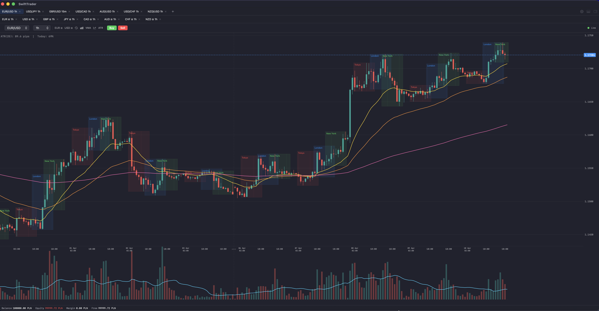
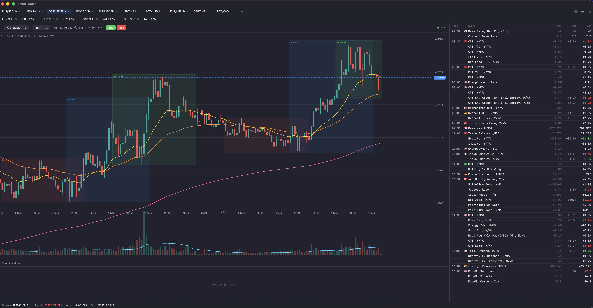
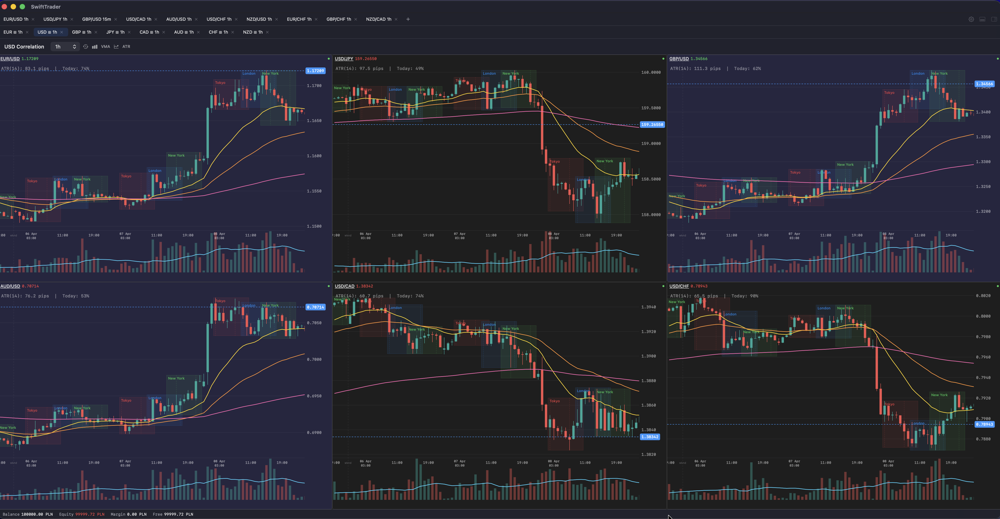

# SwiftTrader

> **Work in progress** -- actively under development.

A native macOS forex trading client built with SwiftUI. Designed as a fast, lightweight alternative to Dukascopy's Java-based JForex platform -- no JVM overhead, instant startup, smooth 60fps chart rendering.

Connects to [jforex-server](https://github.com/piotr-maciejek/jforex-server) for market data and order execution via the Dukascopy Broker API.

## Philosophy

SwiftTrader is calibrated for **price action trading**. Clean charts, no indicator bloat -- just candles, price levels, and fast order execution. If you want 47 oscillators stacked on top of each other, this isn't the tool for you.

## Screenshots







## Features

- **Canvas-based candlestick chart** with drag-to-scroll, mouse wheel zoom, and live streaming
- **Multiple tabs** -- each with independent instrument and timeframe
- **Visual order entry** -- click Buy/Sell to place a visual order box on the chart with draggable SL/TP lines, adjustable position size (+/- buttons), live R:R and pip calculations. Entry price tracks the market in real-time. Confirm or cancel directly on the chart (or Enter/Escape). Multiple visual orders supported across different instruments
- **Positions panel** -- open positions with live P&L, draggable SL/TP modification, and close button
- **Economic calendar** -- right panel (⌥⌘0) showing today's economic events from Dukascopy with country, actual/expected/previous values color-coded (green = beat, red = miss), streamed live via WebSocket
- **Currency correlation screens** -- click a currency button (e.g. "EUR", "USD") in the chart header to open a 6-chart grid showing all pairs containing that currency, with synchronized timeframes
- **Market session overlays** -- Tokyo, London, and New York sessions drawn as colored rectangles on the chart, with dashed lines marking actual stock exchange open/close times. Forex session hours match TradingView conventions; DST-aware via IANA timezone database. Togglable via the clock icon in the chart header
- **Auto-reconnect** -- handles server restarts gracefully

## Running

Requires [jforex-server](https://github.com/piotr-maciejek/jforex-server) running on `localhost:8080`.

```bash
xcodebuild -scheme SwiftTrader -destination 'platform=macOS' -derivedDataPath build build
open build/Build/Products/Debug/SwiftTrader.app
```

Or open `SwiftTrader.xcodeproj` in Xcode and run (⌘R).
